<!-- Profile art is reproducible from the scripts/ directory. The contribution
     calendar is refreshed daily by .github/workflows/update-profile-art.yml. -->

<h3><code>alexsandrrh@github:~$ ./contributions.sh</code></h3>

 
 

<h3><code>alexsandrrh@github:~$ whoami</code></h3>

<table>
<tr>
<td valign="top"></td>
<td valign="top"></td>
</tr>
</table>

 
 

<h3><code>alexsandrrh@github:~$ ./connect.sh</code></h3>

<strong>Senior Product Engineer · Frontend Systems · Full-stack Products · AI Agents</strong>

